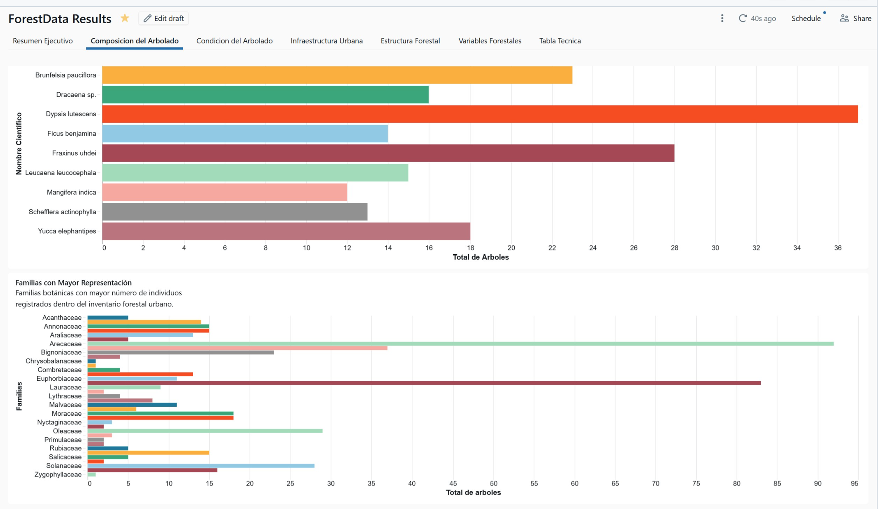
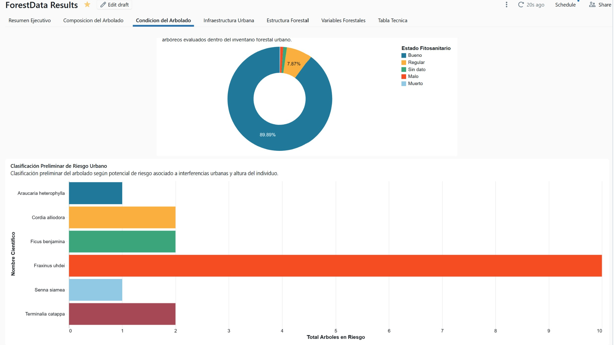
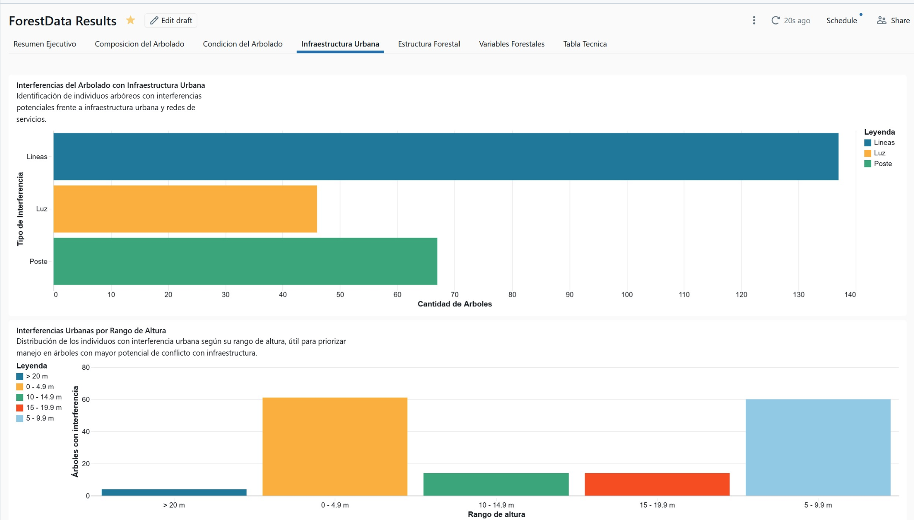
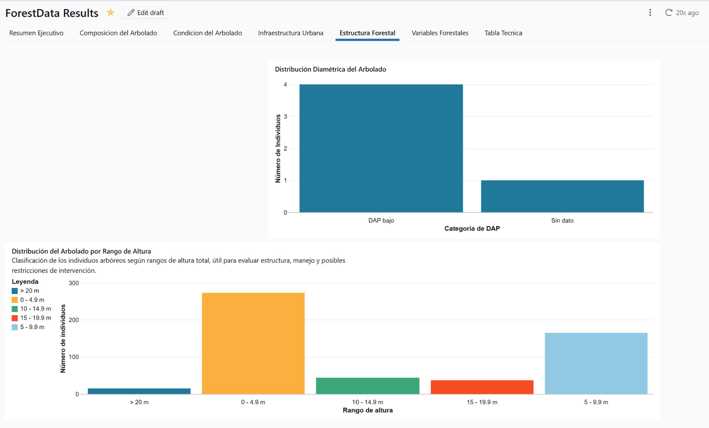
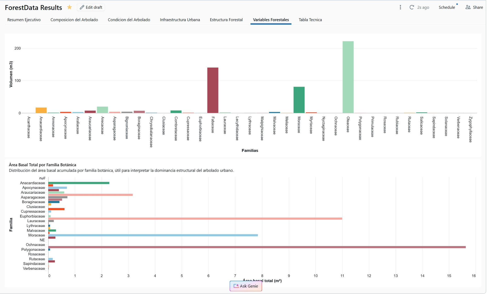
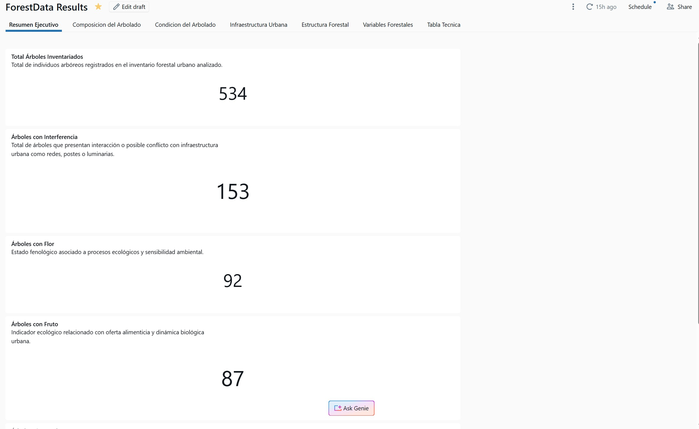
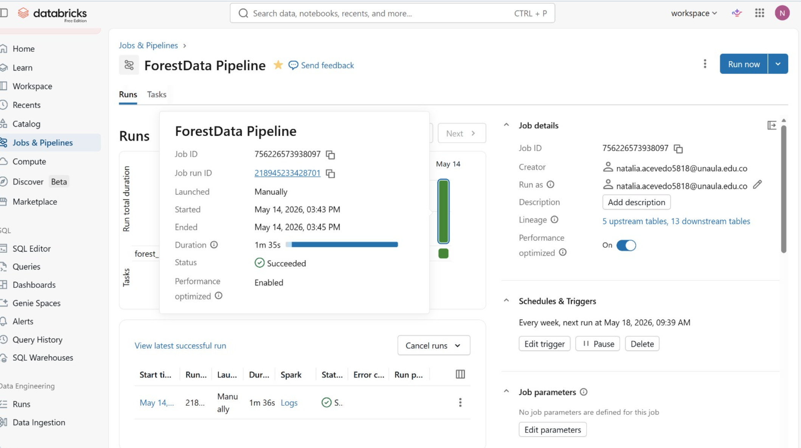
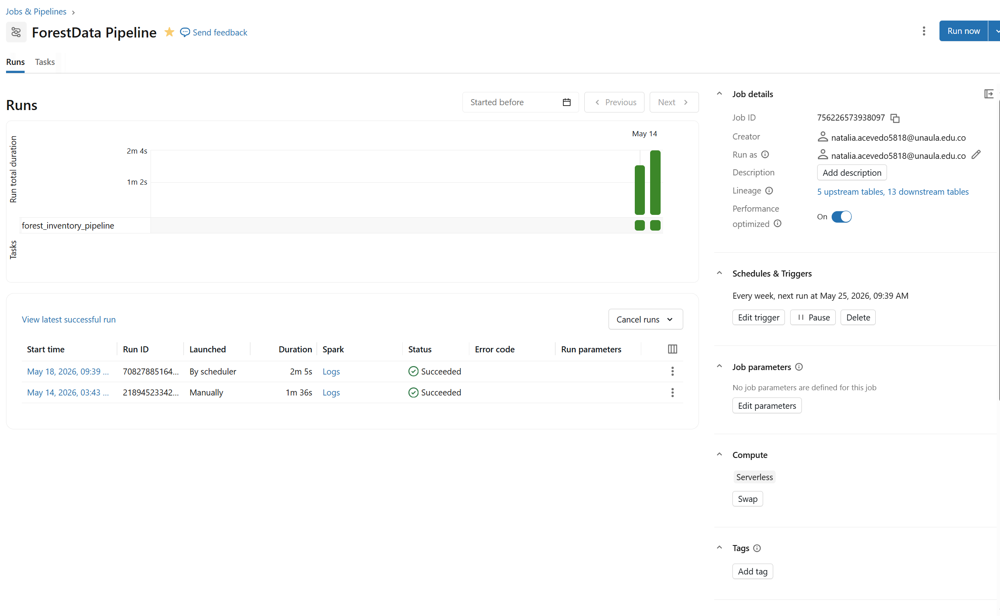
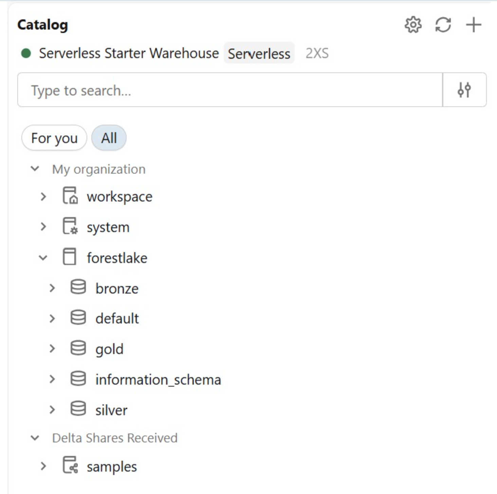

# 🌳 ForestLake — Urban Forest Big Data Pipeline 🌿

> *Transforming urban forest inventory data into environmental insights through Big Data analytics.*


---

# 🌎 What is this project about?

Cities contain thousands of trees that interact every day with roads, buildings, power lines and urban infrastructure. Managing this information manually can become difficult, especially when environmental authorities and engineering projects require fast and reliable analysis.

This project was developed to transform raw forest inventory data into organized environmental information using Big Data technologies. Through automated pipelines, ecological variables, risk indicators and interactive dashboards, the system helps understand:

- 🌳 Which tree species dominate the area
- ⚠️ Where urban interferences exist
- 🌿 The health condition of the trees
- 📏 How tree height and diameter are distributed
- 🏙️ Which individuals may represent urban risk

Even for people without experience in forestry or data science, the dashboards allow environmental and urban information to be explored visually and intuitively.

---

# 📑 Table of Contents

- [🌎 Project Overview](#-what-is-this-project-about)
- [🎯 Objectives](#-objectives)
- [🏗️ Architecture](#️-architecture)
- [⚙️ Technologies Used](#️-technologies-used)
- [🔄 Data Processing Workflow](#-data-processing-workflow)
- [🌲 Environmental KPIs](#-environmental-kpis)
- [📊 Dashboard & Visual Analytics](#-dashboard--visual-analytics)
- [⚡ Workflow Automation](#-workflow-automation)
- [📸 Project Screenshots](#-project-screenshots)
- [🌱 Final Notes](#-final-notes)
- [🇪🇸 Resumen en Español](#-resumen-en-español)

---

# 🎯 Objectives

- Process urban forest inventory datasets using scalable Big Data tools
- Apply Bronze, Silver and Gold architecture for data engineering workflows
- Generate environmental and urban KPIs for decision-making
- Visualize forestry indicators through interactive dashboards
- Automate pipeline execution using Databricks Workflows

---

# 🏗️ Architecture

The project follows a Medallion Architecture (Bronze, Silver and Gold layers) using Delta Lake.

```text
RAW DATA
   ↓
BRONZE LAYER
(raw ingestion)
   ↓
SILVER LAYER
(cleaning + enrichment)
   ↓
GOLD LAYER
(KPIs + analytics)
   ↓
# DASHBOARD & WORKFLOWS
```

---

# 🥉 Bronze Layer

Raw ingestion of the original forest inventory dataset.

Main tasks:
- Raw data loading
- Initial storage
- Preservation of source structure

---

# 🥈 Silver Layer

Data cleaning, normalization and enrichment.

Main transformations:
- Column standardization
- Null handling
- Ecological variable generation
- Urban interference analysis
- Height and DAP categorization
- Risk enrichment
---

# 🥇 Gold Layer

Creation of analytical tables and environmental KPIs.

Generated analytics:
- Species composition
- Family distribution
- Phytosanitary condition
- Urban interference
- Height ranges
- Urban risk classification
- Forestry volume indicators
- Basal area indicators
---

# ⚙️ Technologies Used
| Technology           | Purpose                     |
| -------------------- | --------------------------- |
| Databricks           | Big Data platform           |
| PySpark              | Distributed data processing |
| Delta Lake           | Structured storage          |
| SQL                  | Data querying               |
| GitHub               | Version control             |
| Dashboards           | Interactive visualization   |
| Databricks Workflows | Automation                  |

---

# 🔄 Data Processing Workflow

The pipeline processes forestry inventory information through automated ETL stages:

1. Raw data ingestion
2. Data cleaning and normalization
3. Ecological enrichment
4. KPI generation
5. Dashboard visualization
6. Automated workflow execution

---

# 🌲 Environmental KPIs

The project includes:

🌳 Total inventoried trees
🌿 Species and family composition
⚕️ Phytosanitary condition
🌸 Flowering and fruiting individuals
⚡ Urban interference with infrastructure
📏 Height and DAP ranges
🚨 Preliminary urban risk classification
🌲 Forestry volume indicators
🌱 Basal area indicators

---

# 📊 Dashboard & Visual Analytics

Interactive dashboards were developed in Databricks to support environmental and urban forestry analysis.

Main visualizations:
- Top species composition
- Dominant botanical families
- Urban interference analysis
- Height range distribution
- Phytosanitary condition
- Forestry volume indicators
- Preliminary urban risk classification

---

# ⚡ Workflow Automation

The pipeline execution was automated using Databricks Jobs and Workflows, enabling scalable scheduled processing and future integration with incoming forestry datasets.

---

# 📸 Project Screenshots

---

## 🌳 Interactive Dashboard Overview


---

## 🌿 Forestry Analytics Table


---

## 📊 Top Species Distribution



---

## 🌱 Phytosanitary Status



---

## ⚡ Urban Infrastructure Interference



---

## 📏 Height Range Distribution



---

## 🌲 Forestry Volume Indicators



---

## 📋 Executive KPI Summary



---

## 🔄 Databricks Workflow & Automation



---

## 💻 Databricks Notebook Pipeline



---

## 🗂️ Databricks Catalog & Data Layers



---

# 🌱 Final Notes

This project demonstrates how environmental and urban forestry information can be transformed into scalable analytical solutions using Big Data technologies.

The workflow combines environmental analysis, urban infrastructure assessment and automated data engineering processes to support decision-making and sustainable urban management.

---

# 🇪🇸 Resumen en Español

---

# 🌳 ¿De qué trata este proyecto?

Este proyecto desarrolla un pipeline de Big Data para el procesamiento, análisis y visualización de inventarios forestales urbanos utilizando Databricks y arquitectura Delta Lake.

La información original del inventario forestal fue transformada mediante procesos ETL en diferentes capas:

Bronze (datos crudos)
Silver (datos limpios y enriquecidos)
Gold (tablas analíticas y KPIs)

El sistema permite analizar:

especies arbóreas dominantes,
estado fitosanitario,
interferencias con infraestructura urbana,
distribución de alturas y diámetros,
volumen forestal,
área basal,
y clasificación preliminar de riesgo urbano.

Además, se construyeron dashboards interactivos y workflows automatizados para actualizar y visualizar la información de manera eficiente.

---

# 🌿 Objetivo

Demostrar cómo tecnologías Big Data pueden apoyar procesos de gestión ambiental, planificación urbana y análisis forestal mediante pipelines automatizados y visualizaciones interactivas.

🛠️ Tecnologías utilizadas
Databricks
PySpark
Delta Lake
SQL
GitHub
Dashboards interactivos

---

# 🌎 Aplicaciones

Este tipo de solución puede aplicarse en:

inventarios forestales urbanos,
estudios ambientales,
compensaciones forestales,
análisis de riesgo urbano,
planificación de infraestructura,
monitoreo ambiental,
y análisis territorial.

---

# 👩‍💻 Author
# Natalia Acevedo Hoyos
